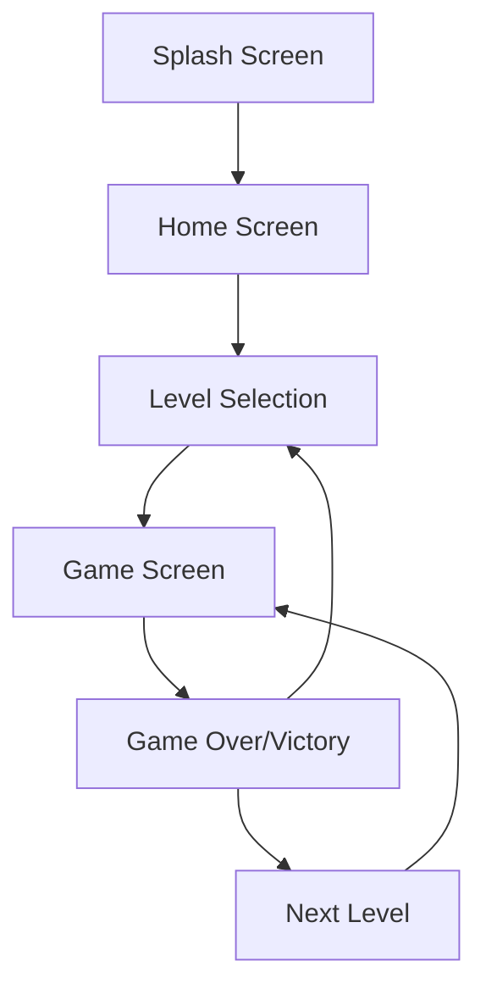

# 🍭 Candy Crush - React Native

> Un juego de rompecabezas móvil match-3 desarrollado en React Native, inspirado en el clásico Candy Crush con mecánicas modernas y progresión de niveles.


## 📱 Plataformas Compatibles

- **Android:** Accede a la aplicación desde cualquier dispositivo Android.  
  [Apk Demo (.apk)](https://github.com/felipesanchez-dev/Candy-Crush/blob/main/apk/Candy%20Crush.apk?raw=true)

- **iOS:** La aplicación es compatible con dispositivos Apple (iPhone, iPad).

## 📱 Descripción del Proyecto

Este proyecto implementa un juego completo de match-3 con características avanzadas incluyendo:

- **10 niveles únicos** con diferentes configuraciones y objetivos
- **Sistema de progresión** con desbloqueo gradual de contenido
- **Animaciones fluidas** usando Reanimated y Lottie
- **Sistema de audio inmersivo** con efectos de sonido contextuales
- **Interfaz responsive** que se adapta a diferentes dispositivos
- **Persistencia de datos** para mantener el progreso entre sesiones

## 🏗️ Arquitectura de Alto Nivel

La aplicación sigue una arquitectura modular con clara separación de responsabilidades:

```
src/
├── components/          # Componentes reutilizables de UI
├── screens/            # Pantallas principales del juego
├── stores/             # Gestión de estado con Zustand
├── utils/              # Utilidades y helpers
├── contexts/           # Contextos de React (Audio, etc.)
├── assets/             # Recursos estáticos (imágenes, sonidos)
└── navigation/         # Configuración de navegación
```

## 🚀 Tecnologías Utilizadas

### Stack Principal

- **React Native 0.76.5** - Framework principal
- **TypeScript** - Tipado estático
- **Zustand** - Gestión de estado global
- **MMKV** - Persistencia de datos nativa

### Navegación y UI

- **@react-navigation/native** - Navegación entre pantallas
- **react-native-responsive-fontsize** - Diseño responsive
- **react-native-gesture-handler** - Manejo de gestos

### Animaciones y Efectos

- **react-native-reanimated** - Animaciones nativas
- **lottie-react-native** - Animaciones vectoriales
- **react-native-sound-player** - Sistema de audio

## 📋 Características Principales

### 🎮 Mecánicas de Juego

| Característica            | Implementación                               | Componentes Clave                |
| ------------------------- | -------------------------------------------- | -------------------------------- |
| **Sistema Match-3**       | Detección de coincidencias en cuadrícula 8x8 | `GameTile`, `gridUtils`          |
| **Progresión de Niveles** | 10 niveles con objetivos únicos              | `useLevelStore`, `gameLevels`    |
| **Sistema de Puntuación** | Cálculo dinámico con multiplicadores         | `ScoreSystem`, `GameLogic`       |
| **Animaciones**           | Transiciones fluidas y feedback visual       | `LottieView`, `useAnimatedStyle` |
| **Audio Contextual**      | Efectos de sonido inmersivos                 | `SoundContext`, `SoundUtility`   |

### 🎯 Funcionalidades del Sistema

- **Persistencia de Progreso**: El juego guarda automáticamente tu progreso
- **Desbloqueo Progresivo**: Los niveles se desbloquean al completar el anterior
- **Puntuaciones Máximas**: Registro de mejores puntuaciones por nivel
- **Feedback Háptico**: Vibraciones para mejorar la experiencia
- **Interfaz Adaptativa**: Se ajusta a diferentes tamaños de pantalla

## 🛠️ Instalación y Configuración

### Prerrequisitos

Asegúrate de tener configurado tu entorno de desarrollo React Native:

- [Configurar tu Entorno](https://reactnative.dev/docs/set-up-your-environment)
- Node.js >= 16
- React Native CLI
- Android Studio / Xcode

### Instalación

1. **Clonar el repositorio**

```bash
git clone <repository-url>
cd CandyCrush
```

2. **Instalar dependencias**

```bash
# Usando npm
npm install

# O usando Yarn
yarn install
```

3. **Instalar dependencias de iOS (solo macOS)**

```bash
cd ios && pod install && cd ..
```

### 🚀 Ejecutar la Aplicación

#### Paso 1: Iniciar Metro

```bash
# Usando npm
npm start

# O usando Yarn
yarn start
```

#### Paso 2: Ejecutar en dispositivo/emulador

**Para Android:**

```bash
# Usando npm
npm run android

# O usando Yarn
yarn android
```

**Para iOS:**

```bash
# Usando npm
npm run ios

# O usando Yarn
yarn ios
```

## 🎮 Flujo de Juego

### Navegación de Pantallas



### Estados del Juego

1. **Inicio**: Pantalla de bienvenida con animación
2. **Selección de Nivel**: Grid de niveles disponibles
3. **Juego Activo**: Mecánicas principales de match-3
4. **Transición**: Animaciones entre estados
5. **Resultado**: Pantalla de victoria/derrota

## 🏪 Gestión de Estado

### Level Store (Zustand)

```typescript
interface LevelState {
  currentLevel: number;
  unlockedLevels: number[];
  levelScores: Record<number, number>;
  totalScore: number;
  // Métodos para actualizar estado
}
```

### Persistencia con MMKV

- **Progreso del jugador** se guarda automáticamente
- **Puntuaciones máximas** persisten entre sesiones
- **Configuraciones** de audio y preferencias

## 🎨 Componentes Clave

### GameTile

Componente individual de cada dulce en la cuadrícula:

- Manejo de gestos (tap, swipe)
- Animaciones de estado
- Detección de coincidencias

### ScalePress

Wrapper para feedback táctil:

- Animaciones de presión
- Feedback háptico
- Escalado suave

### SoundContext

Gestión centralizada de audio:

- Efectos de sonido contextuales
- Control de volumen
- Optimización de rendimiento

## 📱 Diseño Responsive

La aplicación utiliza:

- **react-native-responsive-fontsize** para textos adaptativos
- **Flexbox** para layouts flexibles
- **Dimensiones dinámicas** basadas en el dispositivo
- **SafeAreaView** para compatibilidad con diferentes pantallas

## 🔧 Desarrollo y Debugging

### Scripts Disponibles

```bash
# Desarrollo
npm start                 # Iniciar Metro bundler
npm run android          # Ejecutar en Android
npm run ios             # Ejecutar en iOS

# Debugging
npm run lint            # Verificar código
npm run test           # Ejecutar pruebas
```

### Hot Reload y Fast Refresh

- **Fast Refresh** habilitado por defecto
- **Hot Reload**: <kbd>R</kbd> x2 (Android) o <kbd>R</kbd> (iOS)
- **Dev Menu**: <kbd>Ctrl</kbd> + <kbd>M</kbd> (Windows/Linux) o <kbd>Cmd ⌘</kbd> + <kbd>M</kbd> (macOS)

## 🐛 Solución de Problemas

### Problemas Comunes

| Problema                  | Solución                                  |
| ------------------------- | ----------------------------------------- |
| Metro no inicia           | `npx react-native start --reset-cache`    |
| Error de dependencias iOS | `cd ios && pod install --repo-update`     |
| Problemas de audio        | Verificar permisos en AndroidManifest.xml |
| Animaciones lentas        | Habilitar Hermes en Android               |

### Logs y Debugging

```bash
# Ver logs en tiempo real
npx react-native log-android  # Android
npx react-native log-ios      # iOS

# Flipper para debugging avanzado
npm install -g flipper
```

## 🚀 Próximas Características

### Roadmap Planificado

- [ ] **Sistema de Logros** - Desbloquea logros basados en rendimiento
- [ ] **Modo Multijugador** - Competir con otros jugadores
- [ ] **Power-ups** - Elementos especiales para ayudar en niveles difíciles
- [ ] **Temas Visuales** - Diferentes estilos gráficos
- [ ] **Integración Social** - Compartir puntuaciones
- [ ] **Más Niveles** - Expansión a 50+ niveles únicos

### Integraciones Pendientes

- **Configuración de Nivel Dinámico** - Cargar reglas específicas por nivel
- **Sistema de Logros** - Tracking de métricas de rendimiento
- **Leaderboards** - Comparación de puntuaciones globales

## 📄 Licencia

Este proyecto es de código abierto y está disponible bajo la [Licencia MIT](LICENSE).

## 👨‍💻 Autor

**Felipe Reyes Sanchez**

## 🤝 Contribuciones

Las contribuciones son bienvenidas. Por favor:

1. Fork el proyecto
2. Crea una rama para tu feature (`git checkout -b feature/AmazingFeature`)
3. Commit tus cambios (`git commit -m 'Add some AmazingFeature'`)
4. Push a la rama (`git push origin feature/AmazingFeature`)
5. Abre un Pull Request

## 📞 Soporte

Si encuentras algún problema o tienes preguntas:

- 🐛 **Issues**: [GitHub Issues](https://github.com/tu-usuario/candy-crush/issues)
- 📖 **Documentación**: [React Native Docs](https://reactnative.dev/docs/getting-started)

<br/>

- **Correo:** [jfelipe9.121@gmail.com](mailto:jfelipe9.121@gmail.com)  
- **LinkedIn:** [felipereyessa](https://www.linkedin.com/in/felipereyessa)  
- **Sitio Web:** [Mi Sitio web](https://felipesanchezdev.site)

---

⭐ **¡Dale una estrella al repo si te gustó!** ⭐
