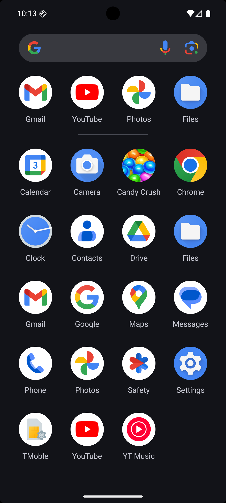
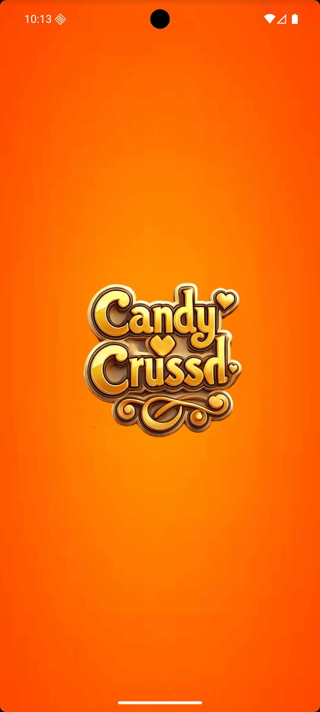
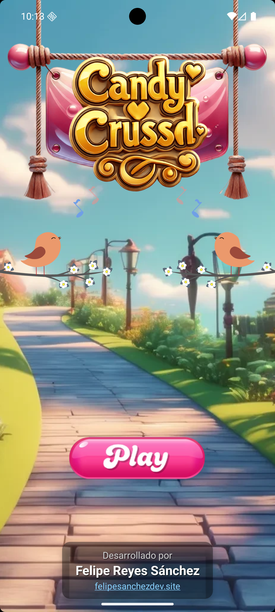
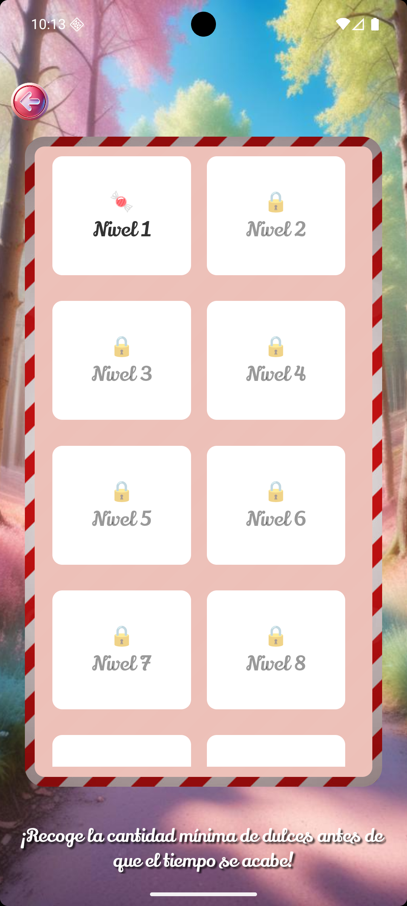
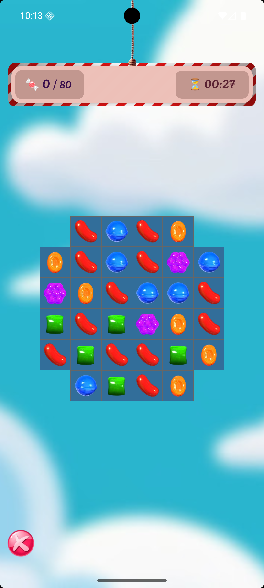
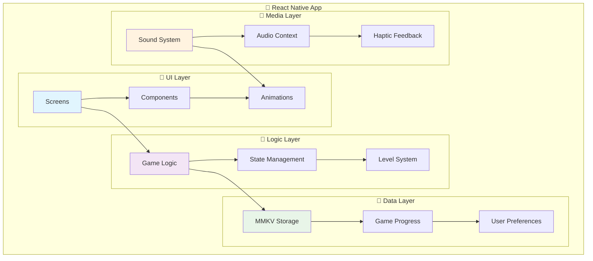
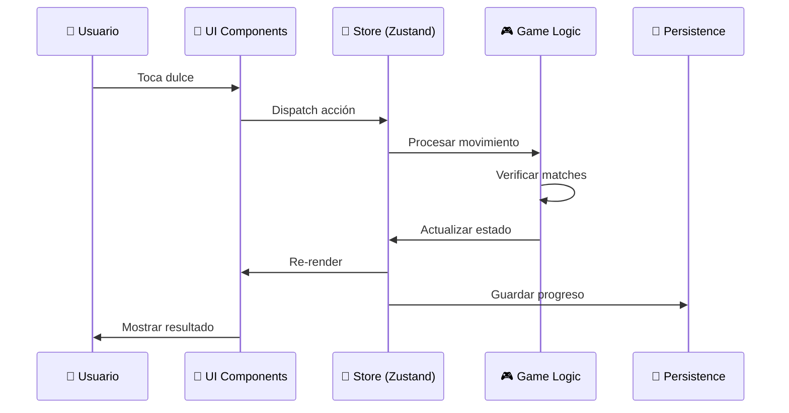
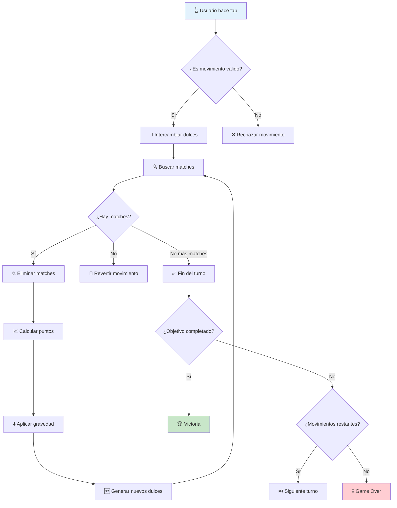
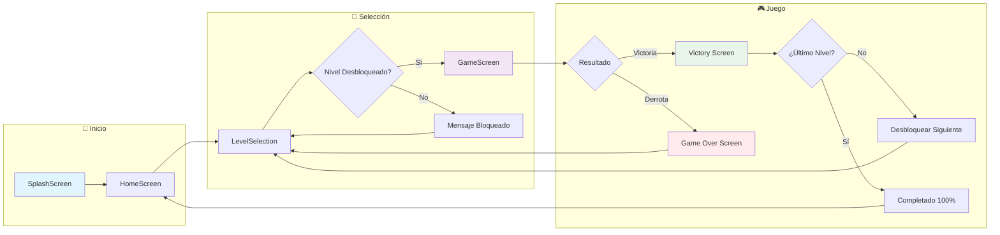
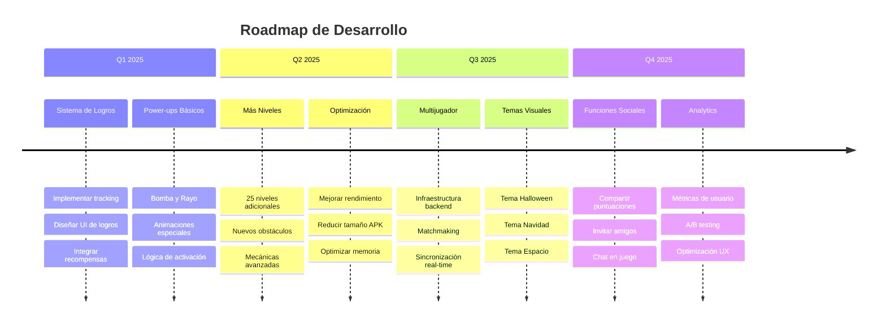

# 🍭 Candy Crush - React Native

> Un juego de rompecabezas móvil match-3 desarrollado en React Native, inspirado en el clásico Candy Crush con mecánicas modernas y progresión de niveles.

<div align="center">


[](https://github.com/felipesanchez-dev/Candy-Crush/blob/main/apk/Candy%20Crush.apk?raw=true)

</div>

## 📋 Tabla de Contenidos

- [🚀 Demo y Descarga](#-demo-y-descarga)
- [📸 Capturas de Pantalla](#-capturas-de-pantalla)
- [🎯 Características Principales](#-características-principales)
- [🏗️ Arquitectura del Proyecto](#️-arquitectura-del-proyecto)
- [⚙️ Tecnologías y Stack](#️-tecnologías-y-stack)
- [🎮 Mecánicas de Juego](#-mecánicas-de-juego)
- [🛠️ Instalación y Configuración](#️-instalación-y-configuración)
- [📱 Flujo de la Aplicación](#-flujo-de-la-aplicación)
- [🔧 Desarrollo y Testing](#-desarrollo-y-testing)
- [🚀 Roadmap](#-roadmap)
- [🤝 Contribuciones](#-contribuciones)

## 🚀 Demo y Descarga

### 📱 Plataformas Compatibles

<table align="center">
<tr>
<td align="center">
<h3>🤖 Android</h3>
<p>Disponible para descarga inmediata</p>
<a href="https://github.com/felipesanchez-dev/Candy-Crush/blob/main/apk/Candy%20Crush.apk?raw=true">

</a>
<br><br>
<code>Tamaño: ~25MB | Android 5.0+</code>
</td>
<td align="center">
<h3>🍎 iOS</h3>
<p>Compatible con iPhone y iPad</p>

<br><br>
<code>Requiere compilación local</code>
</td>
</tr>
</table>

### 🎯 Características de la Demo

- ✅ **10 niveles únicos** con diferentes mecánicas
- ✅ **Progresión guardada** automáticamente
- ✅ **Animaciones fluidas** y efectos visuales
- ✅ **Sistema de audio** inmersivo
- ✅ **Interfaz responsive** para todos los dispositivos

## 📸 Capturas de Pantalla

<div align="center">
  <table>
    <tr>
      <td align="center">
        <br>
        <sub><b>🎨 Ícono de App</b></sub>
      </td>
      <td align="center">
        <br>
        <sub><b>⚡ Splash Screen</b></sub>
      </td>
      <td align="center">
        <br>
        <sub><b>🏠 Menú Principal</b></sub>
      </td>
    </tr>
    <tr>
      <td align="center">
        <br>
        <sub><b>🎯 Selección de Niveles</b></sub>
      </td>
      <td align="center">
        <br>
        <sub><b>🎮 Pantalla de Juego</b></sub>
      </td>
    </tr>
  </table>
</div>

> 💡 **Tip**: Haz clic en cualquier imagen para verla en tamaño completo

## 🎯 Características Principales

### 🎮 Experiencia de Juego

<div align="center">
<table>
<tr>
<td width="50%">

**🧩 Mecánicas Core**
- Sistema Match-3 avanzado
- Detección de patrones complejos
- Combos y cadenas de eliminación
- Power-ups y efectos especiales

</td>
<td width="50%">

**🎨 Experiencia Visual**
- Animaciones fluidas 60fps
- Efectos de partículas
- Transiciones cinematográficas
- Tema visual colorido y atractivo

</td>
</tr>
<tr>
<td>

**📈 Progresión**
- 10 niveles únicos diseñados
- Sistema de desbloqueo progresivo
- Puntuaciones y récords por nivel
- Objetivos variados por nivel

</td>
<td>

**🎵 Audio Inmersivo**
- Efectos de sonido contextuales
- Música de fondo adaptativa
- Feedback háptico en dispositivos
- Controles de audio personalizables

</td>
</tr>
</table>
</div>

### 🏗️ Arquitectura Técnica



## 🏗️ Arquitectura del Proyecto

### 📁 Estructura de Carpetas

```
src/
├── 🎨 components/              # Componentes reutilizables de UI
│   ├── GameTile.tsx           # Componente individual de dulce
│   ├── ScalePress.tsx         # Wrapper para feedback táctil
│   └── common/                # Componentes comunes
│
├── 📱 screens/                # Pantallas principales
│   ├── SplashScreen.tsx       # Pantalla de carga
│   ├── HomeScreen.tsx         # Menú principal
│   ├── LevelScreen.tsx        # Selección de niveles
│   └── GameScreen.tsx         # Pantalla de juego principal
│
├── 🧠 stores/                 # Gestión de estado
│   ├── useLevelStore.ts       # Estado de niveles y progreso
│   └── useGameStore.ts        # Estado del juego actual
│
├── 🛠️ utils/                  # Utilidades y helpers
│   ├── gridUtils.ts           # Lógica de la cuadrícula
│   ├── gameLogic.ts           # Mecánicas del juego
│   └── storage.ts             # Persistencia de datos
│
├── 🎵 contexts/               # Contextos de React
│   └── SoundContext.tsx       # Gestión de audio
│
├── 🎨 assets/                 # Recursos estáticos
│   ├── images/                # Imágenes y sprites
│   ├── sounds/                # Efectos de sonido
│   └── animations/            # Animaciones Lottie
│
└── 🧭 navigation/             # Configuración de navegación
    └── AppNavigator.tsx       # Stack de navegación
```

### 🔄 Flujo de Datos



## ⚙️ Tecnologías y Stack

### 🛠️ Stack Principal

<div align="center">
<table>
<tr>
<td align="center" width="25%">
<br>
<b>React Native</b><br>
<code>0.76.5</code><br>
Framework principal
</td>
<td align="center" width="25%">
<br>
<b>TypeScript</b><br>
<code>100%</code><br>
Tipado estático
</td>
<td align="center" width="25%">
<br>
<b>Zustand</b><br>
<code>^4.4.1</code><br>
Estado global
</td>
<td align="center" width="25%">
<br>
<b>MMKV</b><br>
<code>^2.10.1</code><br>
Persistencia
</td>
</tr>
</table>
</div>

### 🎨 UI y Animaciones

| Librería | Versión | Propósito | Documentación |
|----------|---------|-----------|---------------|
| **react-native-reanimated** | `^3.8.1` | Animaciones nativas de alto rendimiento | [Docs](https://docs.swmansion.com/react-native-reanimated/) |
| **lottie-react-native** | `^6.4.1` | Animaciones vectoriales complejas | [Docs](https://github.com/lottie-react-native/lottie-react-native) |
| **react-native-gesture-handler** | `^2.14.0` | Gestos y toques avanzados | [Docs](https://docs.swmansion.com/react-native-gesture-handler/) |
| **react-native-responsive-fontsize** | `^0.5.1` | Tipografía responsive | [Docs](https://github.com/heyman333/react-native-responsive-fontsize) |

### 🎵 Audio y Multimedia

| Librería | Versión | Propósito |
|----------|---------|-----------|
| **react-native-sound-player** | `^0.13.2` | Reproducción de audio |
| **react-native-haptic-feedback** | `^2.2.0` | Feedback háptico |

## 🎮 Mecánicas de Juego

### 🧩 Sistema Match-3



### 🎯 Tipos de Objetivos por Nivel

<div align="center">
<table>
<tr>
<td align="center" width="33%">
<h4>📊 Puntuación</h4>
<p>Alcanzar una puntuación mínima</p>
<code>Ejemplo: 10,000 puntos</code>
</td>
<td align="center" width="33%">
<h4>🍭 Recolección</h4>
<p>Eliminar dulces específicos</p>
<code>Ejemplo: 20 dulces rojos</code>
</td>
<td align="center" width="33%">
<h4>🧱 Obstáculos</h4>
<p>Romper bloques especiales</p>
<code>Ejemplo: 5 bloques de hielo</code>
</td>
</tr>
</table>
</div>

### 🎲 Sistema de Puntuación

```typescript
// Ejemplo del sistema de puntuación
interface ScoreSystem {
  basePoints: {
    match3: 100,    // 3 dulces en línea
    match4: 200,    // 4 dulces en línea
    match5: 500,    // 5 dulces en línea
    lShape: 300,    // Forma de L
    tShape: 400,    // Forma de T
  },
  multipliers: {
    combo: 1.2,     // Por cada combo consecutivo
    special: 2.0,   // Al usar power-ups
    timeBonus: 1.5, // Bonus por tiempo restante
  }
}
```

## 🛠️ Instalación y Configuración

### 📋 Prerrequisitos

<div align="center">
<table>
<tr>
<td align="center" width="50%">

**🖥️ Sistema de Desarrollo**
- Node.js >= 18.0.0
- npm >= 8.0.0 o Yarn >= 1.22.0
- Git
- Editor de código (VS Code recomendado)

</td>
<td align="center" width="50%">

**📱 Desarrollo Móvil**
- React Native CLI
- Android Studio (para Android)
- Xcode (para iOS - solo macOS)
- JDK 11 o superior

</td>
</tr>
</table>
</div>

### 🚀 Instalación Rápida

```bash
# 1️⃣ Clonar el repositorio
git clone https://github.com/felipesanchez-dev/Candy-Crush.git
cd Candy-Crush

# 2️⃣ Instalar dependencias
npm install
# o
yarn install

# 3️⃣ Para iOS (solo macOS)
cd ios && pod install && cd ..

# 4️⃣ Iniciar Metro Bundler
npm start
# o
yarn start

# 5️⃣ Ejecutar en dispositivo/emulador
# Android
npm run android

# iOS
npm run ios
```

### 🔧 Configuración Avanzada

<details>
<summary><b>⚙️ Variables de Entorno</b></summary>

Crea un archivo `.env` en la raíz del proyecto:

```env
# Configuración de desarrollo
DEBUG_MODE=true
ENABLE_FLIPPER=true
SOUND_ENABLED=true

# Configuración de audio
DEFAULT_VOLUME=0.8
HAPTIC_ENABLED=true
```

</details>

<details>
<summary><b>🎵 Configuración de Audio</b></summary>

Para Android, asegúrate de que `android/app/src/main/AndroidManifest.xml` tenga:

```xml
<uses-permission android:name="android.permission.VIBRATE" />
<uses-permission android:name="android.permission.MODIFY_AUDIO_SETTINGS" />
```

</details>

<details>
<summary><b>📱 Configuración de Dispositivos</b></summary>

**Para Android:**
```bash
# Verificar dispositivos conectados
adb devices

# Instalar en dispositivo específico
npx react-native run-android --deviceId=<device-id>
```

**Para iOS:**
```bash
# Listar simuladores disponibles
xcrun simctl list

# Ejecutar en simulador específico
npx react-native run-ios --simulator="iPhone 14 Pro"
```

</details>

## 📱 Flujo de la Aplicación

### 🗺️ Mapa de Navegación



### 🎮 Estados del Juego

<div align="center">
<table>
<tr>
<td align="center" width="20%">
<h4>🔄 LOADING</h4>
<p>Cargando recursos</p>
</td>
<td align="center" width="20%">
<h4>🏠 MENU</h4>
<p>Pantalla principal</p>
</td>
<td align="center" width="20%">
<h4>🎯 SELECTING</h4>
<p>Eligiendo nivel</p>
</td>
<td align="center" width="20%">
<h4>🎮 PLAYING</h4>
<p>Jugando activamente</p>
</td>
<td align="center" width="20%">
<h4>🏆 FINISHED</h4>
<p>Nivel completado</p>
</td>
</tr>
</table>
</div>

### 📊 Gestión de Estado Global

```typescript
// Estado principal de la aplicación
interface AppState {
  // Estado del juego
  gameState: 'loading' | 'menu' | 'selecting' | 'playing' | 'finished';
  
  // Progreso del jugador
  player: {
    currentLevel: number;
    unlockedLevels: number[];
    totalScore: number;
    levelScores: Record<number, number>;
  };
  
  // Configuraciones
  settings: {
    soundEnabled: boolean;
    hapticEnabled: boolean;
    volume: number;
  };
  
  // Estado temporal del juego actual
  currentGame?: {
    level: number;
    score: number;
    moves: number;
    objectives: GameObjective[];
    grid: GameTile[][];
  };
}
```

## 🔧 Desarrollo y Testing

### 🛠️ Scripts de Desarrollo

<div align="center">
<table>
<tr>
<td width="50%">

**📱 Ejecución**
```bash
# Iniciar Metro
npm start

# Android
npm run android

# iOS
npm run ios

# Limpiar caché
npm start -- --reset-cache
```

</td>
<td width="50%">

**🔍 Debugging**
```bash
# Logs en tiempo real
npx react-native log-android
npx react-native log-ios

# Análisis de bundle
npx react-native bundle --platform android --dev false --entry-file index.js --bundle-output android/app/src/main/assets/index.android.bundle --assets-dest android/app/src/main/res
```

</td>
</tr>
</table>
</div>

### 🐛 Debugging Avanzado

<details>
<summary><b>🔍 Herramientas de Debug</b></summary>

**Flipper Integration:**
```bash
# Instalar Flipper
npm install -g flipper

# Habilitar en desarrollo
# Ya configurado en el proyecto
```

**React Native Debugger:**
```bash
# Instalar
npm install -g react-native-debugger

# Usar
# Presiona Cmd+D (iOS) o Cmd+M (Android) → Debug
```

</details>

### 🧪 Testing

<details>
<summary><b>🧪 Configuración de Testing</b></summary>

```bash
# Instalar dependencias de testing
npm install --save-dev jest @testing-library/react-native

# Ejecutar tests
npm test

# Tests con coverage
npm test -- --coverage
```

**Ejemplo de test unitario:**
```typescript
// __tests__/gameLogic.test.ts
import { findMatches } from '../src/utils/gameLogic';

describe('Game Logic', () => {
  test('should find horizontal matches', () => {
    const grid = [
      [1, 1, 1, 2],
      [2, 3, 4, 5],
    ];
    
    const matches = findMatches(grid);
    expect(matches).toHaveLength(3);
  });
});
```

</details>

### 📊 Análisis de Performance

```bash
# Analizar bundle size
npx react-native bundle --platform android --dev false --entry-file index.js --bundle-output /tmp/bundle.js --sourcemap-output /tmp/bundle.map

# Profiling con Flipper
# Usar el Performance tab en Flipper
```

## 🔍 Solución de Problemas

### 🚨 Problemas Comunes

<details>
<summary><b>🤖 Problemas de Android</b></summary>

| Problema | Solución |
|----------|----------|
| **Metro no inicia** | `npx react-native start --reset-cache` |
| **Build falla** | Limpiar: `cd android && ./gradlew clean && cd ..` |
| **Emulador lento** | Habilitar Hardware Acceleration en AVD |
| **Audio no funciona** | Verificar permisos en AndroidManifest.xml |

</details>

<details>
<summary><b>🍎 Problemas de iOS</b></summary>

| Problema | Solución |
|----------|----------|
| **Pods fallan** | `cd ios && pod install --repo-update` |
| **Build error** | Limpiar: `cd ios && xcodebuild clean` |
| **Simulador crash** | Reiniciar simulador y Metro |
| **Signing issues** | Configurar Team ID en Xcode |

</details>

### 📋 Checklist de Deployment

**Pre-deployment:**
- [ ] ✅ Tests pasando
- [ ] 📊 Performance optimizado  
- [ ] 🔒 Permisos configurados
- [ ] 📱 Probado en dispositivos reales
- [ ] 🎵 Audio funcionando correctamente
- [ ] 💾 Persistencia de datos funcionando

**Deployment:**
- [ ] 📦 APK generado y probado
- [ ] 📋 Release notes actualizadas
- [ ] 🏷️ Versión etiquetada en Git
- [ ] 📖 Documentación actualizada

## 🚀 Roadmap

### 🎯 Próximas Características (v2.0)

<div align="center">
<table>
<tr>
<td align="center" width="25%">
<h4>🏆 Sistema de Logros</h4>
<ul align="left">
<li>50+ logros únicos</li>
<li>Tracking de estadísticas</li>
<li>Recompensas por logros</li>
<li>Integración social</li>
</ul>
</td>
<td align="center" width="25%">
<h4>⚡ Power-ups</h4>
<ul align="left">
<li>Bomba: destruye área</li>
<li>Rayo: elimina fila/columna</li>
<li>Arcoíris: elimina color</li>
<li>Martillo: rompe obstáculo</li>
</ul>
</td>
<td align="center" width="25%">
<h4>🌟 Más Niveles</h4>
<ul align="left">
<li>50+ niveles adicionales</li>
<li>Nuevos obstáculos</li>
<li>Mecánicas especiales</li>
<li>Jefe final épico</li>
</ul>
</td>
<td align="center" width="25%">
<h4>👥 Multijugador</h4>
<ul align="left">
<li>Modo cooperativo</li>
<li>Competencia en tiempo real</li>
<li>Leaderboards globales</li>
<li>Torneos semanales</li>
</ul>
</td>
</tr>
</table>
</div>

### 🎨 Mejoras Técnicas Planificadas



### 📈 Métricas de Éxito

| Métrica | Objetivo Q1 2025 | Objetivo Q2 2025 |
|---------|------------------|------------------|
| **Descargas** | 1,000+ | 5,000+ |
| **Retención D1** | 60%+ | 70%+ |
| **Retención D7** | 25%+ | 35%+ |
| **Niveles Completados** | 70% completan nivel 5 | 50% completan nivel 10 |
| **Rating App Store** | 4.0+ ⭐ | 4.5+ ⭐ |

## 🤝 Contribuciones

### 👨‍💻 Cómo Contribuir

<div align="center">
<table>
<tr>
<td align="center" width="25%">
<h4>🐛 Reportar Bugs</h4>
<p>Usa GitHub Issues</p>
<a href="https://github.com/felipesanchez-dev/Candy-Crush/issues/new?template=bug_report.md">

</a>
</td>
<td align="center" width="25%">
<h4>💡 Sugerir Features</h4>
<p>Propón nuevas ideas</p>
<a href="https://github.com/felipesanchez-dev/Candy-Crush/issues/new?template=feature_request.md">

</a>
</td>
<td align="center" width="25%">
<h4>🔧 Contribuir Código</h4>
<p>Fork y Pull Request</p>
<a href="#guía-de-contribución">

</a>
</td>
<td align="center" width="25%">
<h4>📖 Mejorar Docs</h4>
<p>Ayuda con documentación</p>
<a href="#documentación">

</a>
</td>
</tr>
</table>
</div>

### 📝 Guía de Contribución

<details>
<summary><b>🔧 Configuración de Desarrollo</b></summary>

```bash
# 1. Fork el repositorio en GitHub

# 2. Clonar tu fork
git clone https://github.com/felipesanchez-dev/Candy-Crush.git
cd Candy-Crush

# 3. Agregar upstream
git remote add upstream https://github.com/felipesanchez-dev/Candy-Crush.git

# 4. Crear rama de feature
git checkout -b feature/nueva-caracteristica

# 5. Hacer cambios y commit
git commit -m "feat: descripción de la nueva característica"

# 6. Push y crear Pull Request
git push origin feature/nueva-caracteristica
```

</details>

<details>
<summary><b>📋 Estándares de Código</b></summary>

**Convenciones de naming:**
- **Componentes**: PascalCase (`GameTile.tsx`)
- **Funciones**: camelCase (`calculateScore()`)
- **Constantes**: UPPER_SNAKE_CASE (`MAX_MOVES`)
- **Archivos**: kebab-case para utilidades (`game-logic.ts`)

**Commit Messages:**
```
feat: nueva característica
fix: correción de bug
docs: actualización de documentación
style: cambios de formato
refactor: refactorización de código
test: agregar o modificar tests
chore: tareas de mantenimiento
```

</details>

### 🎯 Áreas que Necesitan Ayuda

- 🎮 **Diseño de Niveles**: Crear nuevos niveles desafiantes
- 🎨 **Arte y Animaciones**: Mejorar assets visuales
- 🐛 **Testing**: Escribir tests unitarios y de integración
- 📖 **Documentación**: Mejorar guías y tutoriales
- 🌍 **Localización**: Traducir a otros idiomas
- 📱 **Optimización**: Mejorar rendimiento en dispositivos antiguos

## 📄 Licencia

Este proyecto está licenciado bajo la Licencia MIT - ver el archivo [LICENSE](LICENSE) para detalles.

```
MIT License

Copyright (c) 2024 Felipe Reyes Sanchez

Permission is hereby granted, free of charge, to any person obtaining a copy
of this software and associated documentation files (the "Software"), to deal
in the Software without restriction, including without limitation the rights
to use, copy, modify, merge, publish, distribute, sublicense, and/or sell
copies of the Software, and to permit persons to whom the Software is
furnished to do so, subject to the following conditions:

The above copyright notice and this permission notice shall be included in all
copies or substantial portions of the Software.
```

## 👨‍💻 Autor

<div align="center">
<table>
<tr>
<td align="center">
<br>
<b>Felipe Reyes Sanchez</b><br>
<sub>Full Stack Developer</sub><br><br>
<a href="mailto:jfelipe9.121@gmail.com">

</a>
<a href="https://www.linkedin.com/in/felipereyessa">

</a>
<a href="https://felipesanchezdev.site">

</a>
</td>
</tr>
</table>
</div>

## 📞 Soporte

<div align="center">

### 🆘 ¿Necesitas Ayuda?

<table>
<tr>
<td align="center" width="33%">
<h4>🐛 Issues Técnicos</h4>
<p>Para bugs y problemas técnicos</p>
<a href="https://github.com/felipesanchez-dev/Candy-Crush/issues">

</a>
</td>
<td align="center" width="33%">
<h4>📧 Contacto Directo</h4>
<p>Para consultas específicas</p>
<a href="mailto:jfelipe9.121@gmail.com">

</a>
</td>
</tr>
</table>

</div>

### 📚 Recursos Útiles

- 📖 **[React Native Docs](https://reactnative.dev/docs/getting-started)** - Documentación oficial
- 🎨 **[Reanimated Docs](https://docs.swmansion.com/react-native-reanimated/)** - Guía de animaciones
- 🧠 **[Zustand Docs](https://github.com/pmndrs/zustand)** - Gestión de estado
- 🔧 **[TypeScript Handbook](https://www.typescriptlang.org/docs/)** - Guía de TypeScript

---

<div align="center">

### ⭐ ¡Dale una estrella si te gustó el proyecto! ⭐

<a href="https://github.com/felipesanchez-dev/Candy-Crush/stargazers">

</a>

**¡Gracias por tu interés en Candy Crush React Native!** 🍭

*Si tienes alguna pregunta o sugerencia, no dudes en contactarme.*

</div>